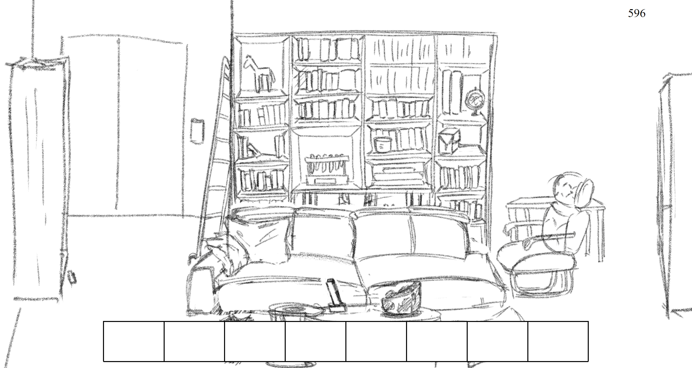

# A race against time! wake up sleepy scientist
This is a prototype of a game where you're a bodyguard who's supposed to wake up a scientist sleeping in his lab before he misses his important conference. It doesn't look like it right now because there's no time to add proper context but for a prototype it does the job

I chose to make this game because I've always liked escape room games and I've been wanting to make an escape room game since january, I had it planned and I was frustratingly trying to learn how to make it on unity before giving up within a week because college leaves me with no time. So when it was time to pick a game to make, it seemed like the most obvious choice.

## references
[position relative/absolute](https://css-tricks.com/almanac/properties/p/position/)
[Linking javascript files together without node.js](https://www.scaler.com/topics/javascript/import-js-file-in-js/)
Time tracking function
> the code gets broken in the .md file so feel free to copy and past it

> https://www.shecodes.io/athena/52336-how-to-create-a-countdown-timer-in-javascript#:~:text=let%20count%20%3D%2060%3B%20const%20timer,")%3B%20%7D%20%7D%2C%201000)%3B

## technology used
- vscode -> coding
- git bash -> control
- github -> version control
- milanote -> visual planning
- clip studio paint -> art
- microsoft to do -> organization

## future enhancement
There are many things I want to improve. I want to add more puzzles, the laptop should be unlockable in the future, some items were clumped together thanks to time limits, I want them to be found in different places. I want to add more rooms, and i want many things to be clickable and display text even if they don't progress the game

I would also like to change the UI, add an actual construction for the time tracker, back button, skip button, dialogue box, real sprites, real objects in the inventory, finished art instead of sketches, and actual context, dialogue for a beginning and an end scene, and a splash screen.