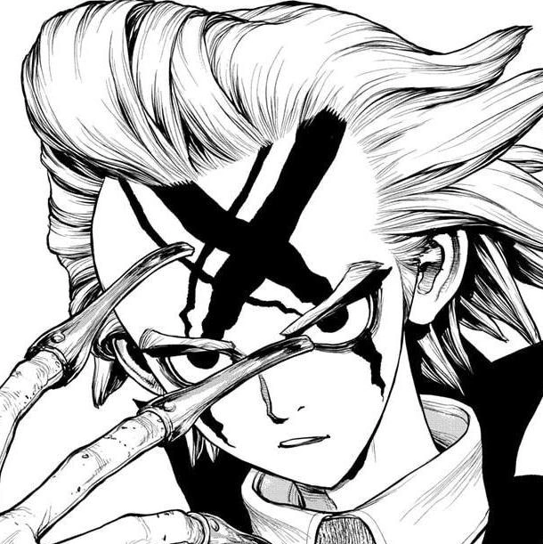

> here i will mess around to find out what i need by rambling.

# the first section relates directly to the functionality
## generally:
the main things in the game are
- the dialogue
- the clickable items
- the inventory and the things that can be kept in it
- the UX/UI

the extra things i can add to the mvp once its done
- more puzzles
- more rooms
> these i will do when the time comes because im running out of time

## dialogue
### main:
- an element to display the dialogue which can be clicked
- sprites
- a script
- a variable representing the current place in dialogue
- a variable that represents the current scene
- a method that displays the dialogue

### level up:
- a method that sets the dialogue location variable to the end of the scene

### level up stage 2:
- a method that can go back in the dialogue
- a method that can display past dialogue in a history section

## clickable items
### main:
- variable for items that i can click
- a function that displays certain scenes when an object is clicked
- if the object can be kept in the inventory, i need a function that saves it in the inventory
- if the object can't be saved in the inventory return the previous state
- for some objects, i need specific functions for each object tho display some sort of change, for example: a number pad that displays the entered number and either allows us to get in or keeps the door shut

### level up stage 2:
- for some objects, a function that allows a person to see a different image of an object based on where they click

## inventory
### main:
- the function that shows the item from the inventory is likely the same as that that displays it from the background
- a function that accepts two parameters and when it receives a specific combination it does some sort of change

### level up stage 2:
- a function that allows the user to rearrange the items in the inventory (not important so im pushing it back)

## UI/UX
### main:
- an HTML element for the inventory likely ties to an array
- an element for keeping track of time
- a function that keeps track of the change in time that starts with the start of the game play and not before that, when the time ends, it displays a losing scene/image
- a background

### level up:
- a pause button
- a function that stops the timer
- a button/ place to click to take the user to a new room
- a function that takes me to a new room (a new HTML?)
- a change in the element that keeps track of time to show that the user is close to losing
- an edit to the time tracker to make it change the element or at least its color to show loss of time

### level up stage 2:
- an element that when clicked will trigger a function that displays a hint
- a button that displays the history
- a function that grabs the previous few lines of dialogue
- a button for the menu
- a function that displays the menu
  - a button to start a new game
    - a function that resets all the variables and returns to the beginning state 
  - a button to save the game
    - a function that does that

# the other section of these notes is an outline for the story
## the main premise
dr. Xeno is a well known Nasa scientist, he is also very well known by Stanley, his bodyguard and former military man for having a terrible sleeping schedule. Xeno is having the press conference that will determine the rest of his professional life's projectile, but as Stanley arrived to take him he found the place a mess and dr. Xeno nowhere to be found. He looks around and searches for clues to find dr. Xeno and help him get ready in time

## the characters
naturally, dr xeno houston wingfield

and stanley snyder

don't belong to me. They belong to Riichiro Inagaki and BOICHI

I need to reread the manga and take notes of their talking patterns and personalities because it's been a while and I don't remember much. for the purposes of the course i might change in their names and designs to avoid issues, but something that can fairly easily fix later on

### general description
in general tho, Xeno is overdramatic, he has big dreams and puts a lot of effort into them. He is more than aware of the limitations of the human body and I don't remember if he was particularly bad at taking care of himself, he was probably a lot better at it than i'm painting him to be but for the purposes of this game I'll make him particularly stressed about tomorrow so he's doing a particularly bad job.

while Stanley is a lot more stoic, he smokes while spending his time alone quietly, he is a very skilled fighter, very chill, very patient yet very determined and his actions speak louder than what his emotions can convey. He is rather smart and quick witted too.

Xeno is a crazy evil scientist currently working at Nasa with less than ethical plans in store. Stan is his childhood best friend and military man who's taking time off to accompany Xeno in his big day.

## Events of the game

the game starts with a general description of the premise of the game via a conversation between Xeno and Stanley.
> the main points conveyed by this conversation are:

> 1. What is happening tomorrow

> 2. Stanley explains that Xeno doesn't usually sleep well before big days

> 3. Xeno tells stanley to come to the lab if he can't find him

Once Stanley left Xeno stayed up a bit longer working on his presentation. He was getting sleepy and tried to get some coffee, accidentally spilling some on the floor. then he decided not to drink it so he left it in the fridge. He went to bed but instead of sleeping he was wide awake thinking about all the possibilities of things going wrong. Which made him go to his lab in his pajamas to check on his plan again. Then he got sleepy and dozed off to sleep on his desk.

the next morning starts and Stanley is here but he can't find Xeno, he looks around but Xeno isn't here. He calls and finds no response. He looks in other rooms and there's no one.

the logical next step is to try to get in the lab, so he types in the usual combination but it doesn't work. he tries three times total but can't get in. He calls Xeno's phone a few times but gets no answer because Xeno's phone is in the bedroom near the bed. he calls Xeno's name but hears no response.

he stands there wondering what to do then goes back to the main room. He sits down trying to think of what to do (as a joke he can think about blowing up the door, thus we can make him clickable here) then he remembers that he can either get Xeno's fingerprints or try a picture of his eye to bypass a different method of security.

The Phone can be a puzzle where he searches for Xeno's picture but it doesn't work out on the door

He gets the fingerprint kit out from xeno's where ever he puts it

Stan looks around the house, he can find Xeno's coffee but the fingerprints on it were bad either because coffee is spilled on it or using the copying fingerprint method doesn't work on the container. (I'll have to look into this)

He can find Xeno's phone near his bed, he can't take fingerprints because Xeno's huge claws ruin its shape

He can find a password on the fridge made from random shapes, and a paper to decipher that in the library

He can find half a paper of a number in the closet and the other half under a pair of shoes thrown somewhere

He can find Xeno's laptop maybe in a case with a number puzzle on it, that's probably where he'll get proper fingerprints, the laptop's background is a picture of stan's birthday with his birth year on it. a player can either choose the fingerprints ending (easy) or the password ending (more difficult)

consider the possibility the secret number is Stan's birth year and Xeno didn't tell Stan he changed it because he forgor, he likely changed it because someone else found out about it and he couldn't think of another at that moment

Stan wakes up Xeno and if the ending the player chose was the number pad They can unlock a new dialogue where Stan asks about it. Xeno get's ready and goes to his conference and he doesn't get approved because world domination is still not an ethical pursuit

> i will need to search into finding fingerprints because I know there's an easy way to do it.

### in conclusion
**Exposition tools:**
- Stanley's phone
- Xeno's coffee
- Xeno's phone

**Actual clues:**
- fingerprints kit
- Xeno's laptop
- the password on the fridge
- the decipher code in the library
- half a password in the closet
- half a password under shoes
- Xeno's laptop case

**Puzzles**
- number pad
- eye reader
- fingerprint reader
- xeno's laptop

### the real path to finding Xeno:
- Get the fingerprint kit
- (or) Get the password for Xeno's laptop in a note made of shapes
  - find the translation of shapes to words in a book in xeno's library

- find half a password in a wardrobe
- find the other half under a shoe thrown on the ground
- Get the password for the brief case number
- Open the case and obtain the laptop

Either
- Get the fingerprints from the laptop
- Open the door

Or
- Open the laptop
- find stan's bday year
- Open the door

> to refine this, I need to figure out: How to make it longer Organize into mvp and extra, What things should I keep and which should I discard